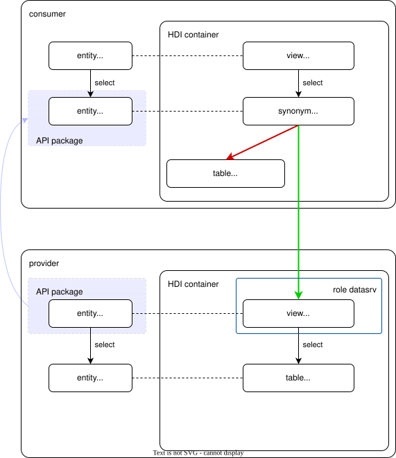

# Welcome to @cap-js/cds-federation-synonyms

<!-- add reuse badge -->

## About this project

CDS plugin for SAP HANA synonym-based data federation.

This plugin is still **experimental**.

For CAP applications using SAP HANA as database, this plugin enables
CAP-to-CAP data federation by integration on the database layer via synonyms.

In the database schema of the application that consumes the data ("consumer"), the
imported entities are represented as synonyms that point to the respective tables or
views in the database schema of the application that provides the data ("provider").
Acess to the producer is read-only.

Visit [CAP-level Data Federation](https://pages.github.tools.sap/cap/docs/guides/integration/data-federation#cap-level-data-federation)
to learn about the basics.


## Requirements

* @sap/cds-dk version 9.9 or higher.
* Both "provider" and "consumer" are CAP apps, using SAP HANA as database.
* Both "provider" and "consumer" run in the same SAP HANA instance, and,
  if Native Multitenancy in SAP HANA Cloud is switched on, live in the same tenant.

The plugin uses two components which are under SAP properity licesenses. You need to review and accept them if you consume the plugin:
* @sap/hdi
* @sap/xssec


## Usage

Install the plugin both in the provider and in the consumer app.
If the consumer uses multi-tenancy, install the plugin in the consumer's MTX sidecar, too.

```sh
npm install git+https://github.tools.sap/cap/cds-df-synonyms.git
```

### Provider

Define an API package with a data service annotated with `@data.product: 'via-synonym'` and export it.
For more information on API packages, see
[CAP-level Data Federation](https://pages.github.tools.sap/cap/docs/guides/integration/data-federation#cap-level-data-federation).

### Consumer

Import the API package, define consumption views on top of the imported entities and use them
in your app's CDS model as described in
[CAP-level Data Federation](https://pages.github.tools.sap/cap/docs/guides/integration/data-federation#cap-level-data-federation).

On HANA, the entities in the imported data service are represented by synonyms that can either point to
local mock tables (synonyms are "unconnected"), or to the respective tables/views in the provider app (synonyms are "connected").

The choice between connected and unconnected is made on service level.
For a single tenant app, it is a deployment decision. For the tenants of a multi tenant app,
the synonyms can be switched between connected and unconnected during runtime via an
[API](./doc/config-service-api.md) provided by the plugin.

### Schematic example

Consumer app:
```cds
// --- consumption view
@federated entity consumption.Books as projection on datasrv.Books { /* ... */ }

// --- imported API
@data.product: 'via-synonym' @cds.external
service datasrv {
  @readonly entity Books { /*...*/};
  // ...
}
```

Provider app:
```cds
// --- API definition / data service
@data.product: 'via-synonym'
service datasrv {
  @readonly entity Books as projection on bookshop.Books
  // ...
}

// --- base entity
entity bookshop.Books {
  // ...
}
```

Database objects:  


In the producer app, table `bookshop.Books` is exposed in service `datasrv` via the synonym technique.
For access control, a HANA role `datasrv` is generated that grants `SELECT` privileges
to all entities in the service.

In the consumer app, the imported entity `datasrv.books` is represented by a synonym.
The synonym can point to a local mock table ("unconnected") or to the corresponding view
in the producer app ("connected").

### Walkthrough

For a detailed example, go to [Walkthrough](./doc/walkthrough.md).


## Support, Feedback, Contributing

This project is open to feature requests/suggestions, bug reports etc. via [GitHub issues](https://github.com/cap-js/cds-federation-synonyms/issues). Contribution and feedback are encouraged and always welcome. For more information about how to contribute, the project structure, as well as additional contribution information, see our [Contribution Guidelines](CONTRIBUTING.md).

## Security / Disclosure

If you find any bug that may be a security problem, please follow the instructions found [in our security policy](https://github.com/cap-js/cds-federation-synonyms/security/policy) on how to report it. Please do not create GitHub issues for security-related doubts or problems.

## Code of Conduct

We as members, contributors, and leaders pledge to make participation in our community a harassment-free experience for everyone. By participating in this project, you agree to abide by its [Code of Conduct](https://github.com/cap-js/.github/blob/main/CODE_OF_CONDUCT.md) at all times.

## Licensing

Copyright 2026 SAP SE or an SAP affiliate company and cds-federation-synonyms contributors. Please see our [LICENSE](./LICENSES/Apache-2.0.txt) for copyright and license information. Detailed information including third-party components and their licensing/copyright information is available [via the REUSE tool](https://api.reuse.software/info/github.com/cap-js/cds-federation-synonyms).
